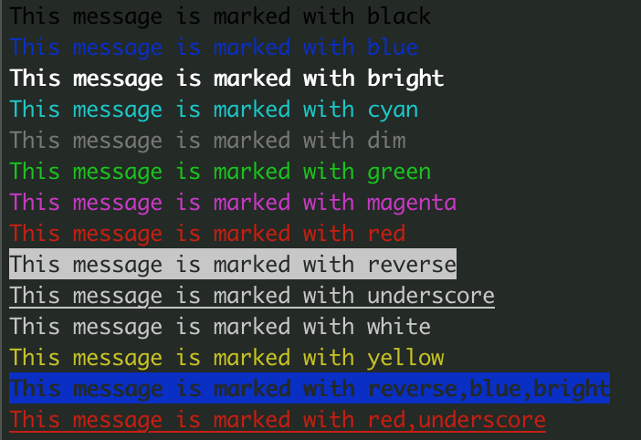

.. raw:: html
	 
    
        
        

.. role:: red
.. role:: norm
.. role:: blue	  

	  
		   
	     
Showcase of easyterm
====================

Welcome to the showcase page of easyterm.
Here, you'll find concisive examples to show the features
offered by this module.

.. contents:: Contents of Tutorial
	         :depth: 3

Showcase set-up
~~~~~~~~~~~~~~~

For the examples below to work correctly, after :doc:`installing easyterm<installation>`,
open python and run this before anything else::

    >>> from easyterm import *
			 
Printing with colors and other markup
~~~~~~~~~~~~~~~~~~~~~~~~~~~~~~~~~~~~~
The module :doc:`colorprint` offers functions to easily print elegant messages
to screen (using ANSI terminal colors).

Function :func:`~easyterm.colorprint.write` works like the python built-in ``print``, but
additionally offers argument ``how``, which accept a markup code which defines the color
used to printing to screen the message.

::
 
    >>> write('This is a message with no markup')

:norm:`This is a message with no markup`

    >>> write('This message is colored!', how='red')

:red:`This message is colored!`

     
There are many markups available, as shown here::
   
     >>> for i in 'black blue bright cyan dim green magenta red reverse underscore white yellow reverse,blue,bright red,underscore'.split():
     ...  write('This message is marked with '+i, how=i)
     

	   
Note that some markups can be combined with others (using commas), as shown in the last two examples above.

Like built-in `print`, write accepts a ``end`` argument, defining what
is appended at the end of each printed message.
By default it is `'\n'`, so that a newline is appended.
Use `end=''` to avoid it, so that the new message will stay on the same line.

We can use this to print messages alternating different markups::

    >>> write('Print with ', end=''); write('AMAZING ', how='yellow', end=''); write('style', how='magenta') 

.. image:: images/colorprint_showcase.2.png
           :width: 350

		   
You may want to consistently highlight certain words to facilitate their visualization identification.
The ``keywords`` argument serves this purpose::

   >>> write("Let's highlight OK and ERROR words:\n #1 is OK \n #2 had ERROR \n #3 is OK", keywords={'OK':'green', 'ERROR':'red'})

.. image:: images/colorprint_showcase.3.png
   :width: 350

   
You may even set keywords globally, so that they're matched in every subsequent call
of write, using :func:`~easyterm.colorprint.set_markup_keywords`::

  >>> set_markup_keywords({'OK':'green', 'NO':'red', '#':'yellow'})
  ... for i in range(10):
  ...     write( f'#{i} divisible by 2? { "OK" if not i%2 else "NO"    }  | divisible by 3? {"OK" if not i%3 else "NO"}' )

.. image:: images/colorprint_showcase.4.png
   :width: 350
		   
*Note: some of the examples above are colored using html; for most accurate results, run the code in a python terminal*

Printing to standard error and service messages
~~~~~~~~~~~~~~~~~~~~~~~~~~~~~~~~~~~~~~~~~~~~~~~

For printing to standard error rather than standard output, use function
:func:`~easyterm.colorprint.printerr`, which takes the same exact arguments as
:func:`~easyterm.colorprint.write`.

Easyterm provides another convenient function, :func:`~easyterm.colorprint.service`,
meant to print messages whose content changes over time, such as a progress status .

::
   
   >>> upto=100000000
   ... write('Starting some heavy computation here!')
   ... for i in range(upto):
   ...    if not i%10000:
   ...        service(f'Currently at {i/upto:.2%} ...')
   ... write('Finally done!')	     

