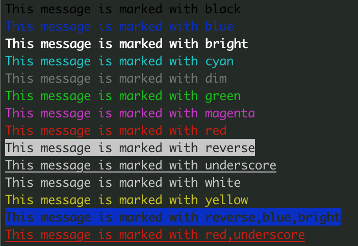
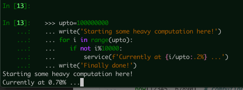
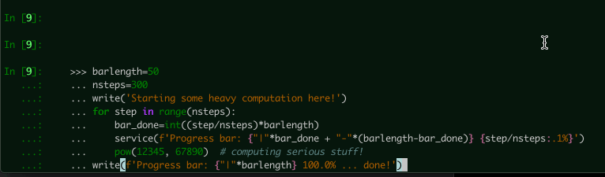
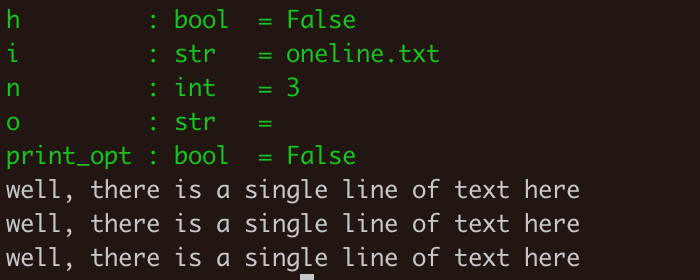
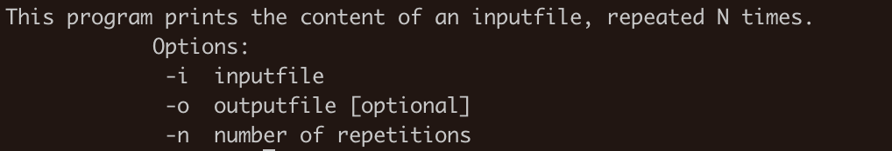

Showcase
========

Welcome to the showcase page of easyterm.
Here, you'll find concise examples to show the features
offered by this module.

.. contents:: Contents 
	         :depth: 3

Showcase set-up
~~~~~~~~~~~~~~~

For the examples below to work correctly, after :doc:`installing easyterm<installation>`,
open python and run this before anything else::

    >>> from easyterm import *
			 
Printing with colors and other markup
~~~~~~~~~~~~~~~~~~~~~~~~~~~~~~~~~~~~~
The module :doc:`colorprint` offers functions to print elegant messages
to screen using ANSI terminal colors.

Function :func:`~easyterm.colorprint.write` works like the python built-in ``print``, but
additionally offers the argument ``how``, which accepts a markup code to define the color
used to printing to screen the message.

::
 
    >>> write('This is a message with no markup')
    ... write('This message is colored!', how='red')

    
     
There are many markups available, as shown here::
   
     >>> for i in 'black blue bright cyan dim green magenta red reverse underscore white yellow reverse,blue,bright red,underscore'.split():
     ...  write('This message is marked with '+i, how=i)
     

	   
Note that some markups can be combined with others using commas, as shown in the last two examples above.

Like built-in ``print``, :func:`~easyterm.colorprint.write` accepts a ``end`` argument, defining what
is appended at the end of each printed message.
By default it is ``'\n'``, meaning that a newline is appended.
Use ``end=''`` to avoid it, so that the new message will stay on the same line.

We can use this to print messages alternating different markups::

    >>> write('Print with ', end='')
    ... write('AMAZING ', how='yellow', end='')
    ... write('style', how='magenta') 

		   
You may want to consistently highlight certain words to facilitate their visualization identification.
The ``keywords`` argument serves this purpose::

   >>> write("Let's highlight OK and ERROR words:\n #1 is OK \n #2 had ERROR \n #3 is OK",
   ...   keywords={'OK':'green', 'ERROR':'red'})

   
You may instead use :func:`~easyterm.colorprint.set_markup_keywords` to set keywords globally, so that they're matched in every subsequent call
of :func:`~easyterm.colorprint.write` (and also :func:`~easyterm.colorprint.printerr`)::

  >>> set_markup_keywords({'OK':'green', 'NO':'red', '#':'yellow'})
  ... for i in range(6):
  ...     write( f'#{i} divisible by 2? { "OK" if not i%2 else "NO"    }' \
  ...               f'| divisible by 3? {"OK" if not i%3 else "NO"}' )

.. image:: images/colorprint_showcase.4.png
   :width: 350

.. warning::
   Setting lots of markup keywords will slow down printing.
	   
Print errors, warnings and progress bars
~~~~~~~~~~~~~~~~~~~~~~~~~~~~~~~~~~~~~~~~

For printing to standard error rather than standard output, use function
:func:`~easyterm.colorprint.printerr`. It takes the same exact arguments as
:func:`~easyterm.colorprint.write`, and equally supports markup::

    >>> printerr('WARNING something went bad and it needs your attention!', how='bright,yellow')

    
Easyterm provides another convenient function, :func:`~easyterm.colorprint.service`,
meant to print messages whose content *changes over time*, by means of overwriting
without changing line, for example to monitor progress status::
   
   >>> upto=100000000
   ... write('Starting some heavy computation here!')
   ... for i in range(upto):
   ...    if not i%10000:
   ...        service(f'Currently at {i/upto:.2%} ...')
   ... write('Finally done!')	     

   
With service, it is straightforward to visualize a progress bar::

    >>> barlength=50
    ... nsteps=300
    ... write('Starting some heavy computation here!')
    ... for step in range(nsteps):
    ...     bar_done=int((step/nsteps)*barlength)
    ...     service(f'Progress bar: {"|"*bar_done + "-"*(barlength-bar_done)} {step/nsteps:.1%}')
    ...     pow(12345, 67890)  # computing serious stuff!
    ... write(f'Progress bar: {"|"*barlength} 100.0% ... done!')

    

.. warning::
    If you use :func:`~easyterm.colorprint.service` in your script, you should avoid using built-in ``print``,
    and stick to :doc:`colorprint` functions :func:`~easyterm.colorprint.write`
    and :func:`~easyterm.colorprint.printerr` for printing messages to screen.
    If you really need to use ``print``, then make sure
    to run :func:`~easyterm.colorprint.flush_service` after running :func:`~easyterm.colorprint.service`
    to make sure subsequent messages are visualized correctly

Reading options from the command line
~~~~~~~~~~~~~~~~~~~~~~~~~~~~~~~~~~~~~~

Python offers various tools to read options provided as you run your script through the command line
(e.g. `argparse <https://docs.python.org/3/library/argparse.html>`_,
`getopt <https://docs.python.org/3/library/getopt.html>`_). Although powerful, these methods are not
concise and often require lots of code for rather basic functionalities, for example to produce a well formatted help page.

The easyterm :doc:`commandlineopt` provides a function to make managing command line options as straightforward as it gets:
:func:`~easyterm.commandlineopt.command_line_options`. 

      
To adopt it in your script, you need to prepare just two objects:

1) *default_opt*: a dictionary defining which options your program accepts, and what are their default arguments. 
2) *help_msg*: the text displayed when your program is run with any of ``-h`` or ``-help`` or ``--help``.

:func:`~easyterm.commandlineopt.command_line_options` returns a dictionary-like object which has
option names as keys and, as their associated values, the arguments to use in the current program execution
(i.e., those provided by the user, or in their absence, default values).

Let's see an example of a python script adopting this model, ``repeat_file.py``:

.. code-block:: python
  
   from easyterm import command_line_options, printerr, write
   def_opt={'i':'inputfile',
            'o':'',
            'n':3}
   help_msg="""This program prints the content of an inputfile, repeated N times.
               Options:
  		   -i  inputfile
  		   -o  outputfile [optional]
  		   -n  number of repetitions"""
   		   
   opt=command_line_options(def_opt, help_msg)
   printerr(opt, how='green')          ## showing what is returned by command_line_options
   if opt['o']:    fh=open(opt['o'], 'w')
   for repetition in range(opt['n']):
       for line in open(opt['i']):
           if opt['o']:    fh.write(line)
           else:           write(line, end='')
  

Let's consider a text file called ``oneline.txt``, whose only content is:

.. code-block:: bash
		
  well, there is a single line of text here

Now, let's run our ``repeat_file.py`` script with this as input:

.. code-block:: bash

   python repeat_file.py -i oneline.txt

This is the result:
   

In green, the script has printed the content of ``opt``.
We see the value of the ``-i`` option we provided on the command line,
while default values where used for ``-o`` (empty string) and ``-n`` (3).

Two special options are always added by :func:`~easyterm.commandlineopt.command_line_options`:
``-h``, which shows the help message when activated, and ``-print_opt``,
which prints active options when activated (pretty much like our script did).
These options are always available (and reserved) in scripts that adopt :func:`~easyterm.commandlineopt.command_line_options`.

If we run our script providing an output file:
  
.. code-block:: bash
		
   python repeat_file.py -i oneline.txt  -o output.txt

We see that the ``-o`` option recorded in ``opt`` was updated accordingly:

If we ran ``repeat_file.py`` with option ``-help``, we would see the help page,
and the script would quit with no action afterwards:

.. code-block:: bash
 
   python repeat_file.py -h

The :func:`~easyterm.commandlineopt.command_line_options` function automatically convert arguments to the
appropriate type, and checks that it is correct for that option. In fact, the ``def_opt`` defines the type
of value accepted for each single option.

So, for example, if you try to provide a string for the integer option ``-n``
(since defined in ``def_opt`` as ``3``) , the program will crash:

.. code-block:: bash

   python repeat_file.py -i oneline.txt -n five

There are five accepted argument types:

- integer (``int``)
- floating point number (``float``)
- string (``str``)
- boolean (``bool``): these options can be given on the command line without argument,
  which results in a ``True`` value. Otherwise, accepted arguments
  are ``1``, ``T``, ``True`` (all resulting in a ``True`` value),
  or ``0``, ``F``, ``False`` (resulting in a ``False`` value).
- list of strings (``list``): these options may accept multiple arguments, which are stored as a python list.
  For example, a list-type ``-files`` option may be used in command line like this: ``-files a.txt b.txt c.txt``.
	   

The function :func:`~easyterm.commandlineopt.command_line_options` has many more features
explained in its documentation, including:
   - **positional arguments**: without an explicit option name
   - **option synonyms**: i.e. you may have the user specify ``-input`` or ``-i`` with the same result
   - **advanced help pages**: option ``-h`` may accept an argument to show specific instructions otherwise not displayed
      
