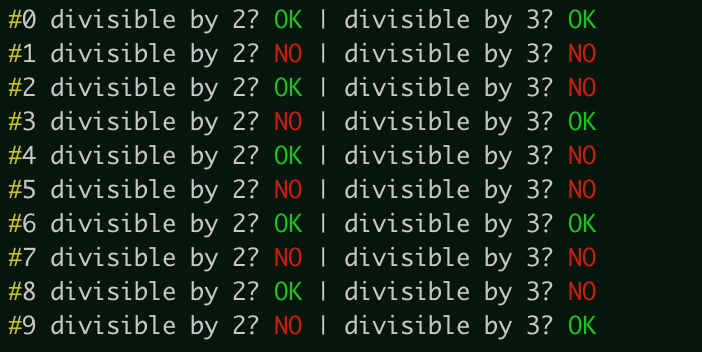

Showcase
========

Welcome to the showcase page of easyterm.
Here, you'll find concise examples to show the features
offered by this module.

.. contents:: Contents 
	         :depth: 3

Showcase set-up
~~~~~~~~~~~~~~~

For the examples below to work correctly, after :doc:`installing easyterm<installation>`,
open python and run this before anything else::

    >>> from easyterm import *
			 
Printing with colors and other markup
~~~~~~~~~~~~~~~~~~~~~~~~~~~~~~~~~~~~~
The module :doc:`colorprint` offers functions to print elegant messages
to screen using ANSI terminal colors.

Function :func:`~easyterm.colorprint.write` works like the python built-in ``print``, but
additionally offers the argument ``how``, which accepts a markup code to define the color
used to printing to screen the message.

::
 
    >>> write('This is a message with no markup')
    ... write('This message is colored!', how='red')

.. image:: images/colorprint_showcase.0.png
   :width: 400
    
     
There are many markups available, as shown here::
   
     >>> for i in 'black blue bright cyan dim green magenta red reverse underscore white yellow reverse,blue,bright red,underscore'.split():
     ...  write('This message is marked with '+i, how=i)
     
.. image:: images/colorprint_showcase.1.png
   :width: 350
	   
Note that some markups can be combined with others using commas, as shown in the last two examples above.

Like built-in ``print``, :func:`~easyterm.colorprint.write` accepts a ``end`` argument, defining what
is appended at the end of each printed message.
By default it is ``'\\n'``, meaning that a newline is appended.
Use ``end=''`` to avoid it, so that the new message will stay on the same line.

We can use this to print messages alternating different markups::

    >>> write('Print with ', end='')
    ... write('AMAZING ', how='yellow', end='')
    ... write('style', how='magenta') 

.. image:: images/colorprint_showcase.2.png
           :width: 350

		   
You may want to consistently highlight certain words to facilitate their visualization identification.
The ``keywords`` argument serves this purpose::

   >>> write("Let's highlight OK and ERROR words:\n #1 is OK \n #2 had ERROR \n #3 is OK",
   ...   keywords={'OK':'green', 'ERROR':'red'})

.. image:: images/colorprint_showcase.3.png
   :width: 350

   
You may instead use :func:`~easyterm.colorprint.write` to set keywords globally, so that they're matched in every subsequent call
of :func:`~easyterm.colorprint.write` (and also :func:`~easyterm.colorprint.printerr`)::

  >>> set_markup_keywords({'OK':'green', 'NO':'red', '#':'yellow'})
  ... for i in range(10):
  ...     write( f'#{i} divisible by 2? { "OK" if not i%2 else "NO"    }' \
  ...               f'| divisible by 3? {"OK" if not i%3 else "NO"}' )

		   
Print errors, warnings and progress bars
~~~~~~~~~~~~~~~~~~~~~~~~~~~~~~~~~~~~~~~~

For printing to standard error rather than standard output, use function
:func:`~easyterm.colorprint.printerr`. It takes the same exact arguments as
:func:`~easyterm.colorprint.write`, and equally supports markup::

    >>> printerr('WARNING something went bad and it needs your attention!', how='bright,yellow')

    
Easyterm provides another convenient function, :func:`~easyterm.colorprint.service`,
meant to print messages whose content *changes over time*, by means of overwriting
without changing line, for example to monitor progress status::
   
   >>> upto=100000000
   ... write('Starting some heavy computation here!')
   ... for i in range(upto):
   ...    if not i%10000:
   ...        service(f'Currently at {i/upto:.2%} ...')
   ... write('Finally done!')	     

   
With service, it is straightforward to visualize a progress bar::

    >>> barlength=50
    ... nsteps=300
    ... write('Starting some heavy computation here!')
    ... for step in range(nsteps):
    ...     bar_done=int((step/nsteps)*barlength)
    ...     service(f'Progress bar: {"|"*bar_done + "-"*(barlength-bar_done)} {step/nsteps:.1%}')
    ...     pow(12345, 67890)  # computing serious stuff!
    ... write(f'Progress bar: {"|"*barlength} 100.0% ... done!')

.. image:: images/colorprint.progress_bar.gif
   :width: 500
    

Note
----
If you use service in your script, you should avoid using built-in ``print``,
and stick to :doc:`colorprint` functions :func:`~easyterm.colorprint.write`
and :func:`~easyterm.colorprint.printerr` for printing messages to screen.
If you really need to use ``print``, then make sure
to run :func:`~easyterm.colorprint.flush_service` after running :func:`~easyterm.colorprint.service`
to make sure subsequent messages are visualized correctly

